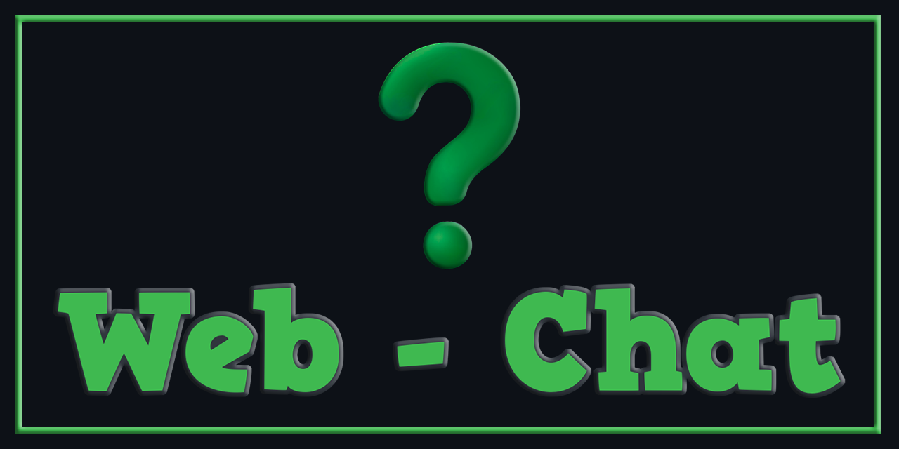

# 🔐 Web Chat — Private & Ephemeral


**Web Chat** es una aplicación de chat web **privada, efímera y anónima**, diseñada bajo el principio de **privacy by design**.

Todos los mensajes se **cifran y descifran exclusivamente en el navegador del usuario**, sin servidores tradicionales, sin cookies, sin tracking y sin retención de datos.

---



---

## 🚀 Características principales

- 🔒 **Cifrado del lado del cliente (client-side encryption)**
- 🏠 **Salas privadas** identificadas por nombre
- 🔑 **Clave secreta compartida** entre participantes
- 🎲 Generación automática de claves seguras
- 👁️ Mostrar / ocultar clave secreta
- 📋 Copiado rápido al portapapeles
- 🖥️ **Interfaz minimalista estilo terminal**
- 🧭 Aplicación Web Progresiva (**PWA**)
- 🛡️ **Privacidad total**: sin cookies, sin analytics, sin almacenamiento persistente

---

## 🧠 ¿Cómo funciona?

1. El usuario **crea o se une** a una sala mediante un nombre.
2. Se establece una **clave secreta compartida** entre los participantes.
3. Cada mensaje se **cifra localmente antes de enviarse**.
4. El receptor **descifra el mensaje únicamente si posee la clave correcta**.
5. No existe almacenamiento permanente ni historial accesible.

> ⚠️ Sin la clave correcta, los mensajes son completamente ilegibles.

---

## 📷 Capturas de pantalla

<p align="center">
  
</p>

```

## 📁 Estructura del proyecto

```text
Web-Chat/
├── app/ # Lógica principal del frontend
├── functions/ # Funciones serverless (Firebase)
├── dist/ # Build final / producción
├── static/ # Recursos estáticos
├── images/ # Imágenes, íconos y previews
│
├── index.html # Interfaz principal del chat
├── info.html # Términos de uso y privacidad
├── styles.css # Estilos globales
├── script.js # Lógica del cliente
├── sw.js # Service Worker (PWA)
├── manifest.json # Configuración PWA
│
├── firebase.json # Configuración Firebase
├── .firebaserc # Proyecto Firebase
├── database.rules.json # Reglas de seguridad
│
├── package.json # Dependencias y scripts
├── package-lock.json # Lockfile
├── .gitignore # Archivos ignorados
├── README.md # Documentación
```

> ℹ️ El backend es **mínimo y serverless**, utilizado únicamente como canal de transmisión, sin acceso al contenido cifrado.

---

## 🖥️ Tecnologías utilizadas

- **HTML5**
- **CSS3** (diseño tipo consola)
- **JavaScript moderno (ES Modules)**
- **Web Crypto API**
- **Clipboard API**
- **Service Workers (PWA)**
- **Firebase Realtime Database (canal efímero)**

---

## 🔐 Seguridad y privacidad

- ❌ No se recopilan datos personales
- ❌ No se usan cookies ni rastreadores
- ❌ No se almacenan mensajes en texto plano
- ✅ Cifrado extremo a extremo en el navegador
- ✅ Arquitectura **stateless**
- ✅ Código auditable y transparente

Consulta más detalles en `info.html`.

---

## 📜 Términos de uso

Este proyecto está destinado a **uso personal y educativo**.

Queda prohibido su uso para:
- actividades ilegales  
- espionaje, acoso o vigilancia  
- vulneración de derechos de terceros  

Las leyes aplicables son las del **Estado Plurinacional de Bolivia**.

---

## 📦 Instalación y uso

No requiere instalación.

1. Clona o descarga el repositorio
2. Abre `index.html` en tu navegador
3. Crea o únete a una sala
4. Comparte la clave secreta por un canal seguro

---

## 🧪 Estado del proyecto

🟢 **Activo / Experimental**

El proyecto se encuentra en evolución constante, priorizando:
- simplicidad  
- privacidad  
- control del usuario  

---

## ✉️ Contacto

- 📧 **Email:** [pharmakoz@gmail.com](mailto:pharmakoz@gmail.com)
- 🏢 **PABLITUS Inc.**

---

## 🧾 Licencia

Este proyecto se distribuye **“tal cual”**, sin garantías explícitas o implícitas.  
Puedes usarlo, modificarlo y estudiarlo bajo tu propia responsabilidad.

---

> 🔐 **Privacidad por diseño. Control total del usuario.**
